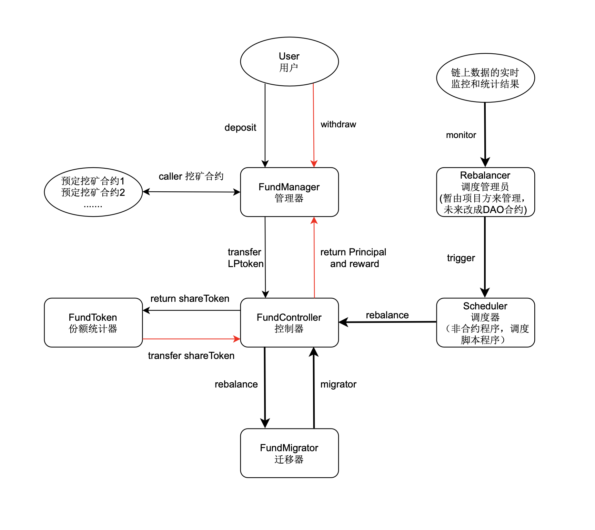

# FundManager

流动性挖矿的管理策略

## 架构示意图

 


## 代码架构示意图

```js
├── FundController.sol
├── FundManager.sol
├── FundMigrator.sol
├── FundToken.sol
├── Migrations.sol
├── interfaces
│   ├── IController.sol
│   ├── IMigrator.sol
│   ├── master
│   │   ├── IBakeryMaster.sol
│   │   ├── IMdexMaster.sol
│   │   └── IPancakeMaster.sol
│   └── swap
│       ├── ISwapV2Factory.sol
│       ├── ISwapV2Pair.sol
│       └── ISwapV2Router.sol
└── owner
    └── Operator.sol
```

合约大致介绍如下：

### FundController 

流动性挖矿的调度合约，主要用于挖矿策略的调整，由于策略不上链，目前主要由一些仅限于管理员调度的接口函数组成：

1、设置管理员（治理合约）、再平衡调度员地址

2、限制挖矿合约范围

3、approve 接口

4、deposit 接口

5、withdraw 接口

6、reward （仅提现奖励）接口

7、rebalance （流动性迁移）接口

8、份额和奖励等查询接口


### FundManager

关于流动性挖矿的用户调用合约，主要用于管理用户的存储和提现调用，并保证本金和利息计算的正确性：

1、设置控制合约对象，用户存储和提现都需要从 Controller 控制合约中得到权限的许可

2、管理用户存储和提现的手续费

3、用户提现和存取的调用处理


### FundMigrator

流动性迁移合约，在不同的流动性挖矿池子用于挖矿的相同的流动代币组成的流动性代币（比如 PancakeSwap 和 bakerySwap 的 BNB-BUSD 组成的流动性代币），进行对应的流动性迁移。

（暂时忽略掉由于瞬间价格大波动导致的流动性失调，需要考虑迁移的时候流动性代币个数问题，无偿损失问题）


### FundToken

ERC20合约，主要用于用户存储流动性代币的份额统计：

1、用户存入一个流动性代币，则得到一个对应的 FundToken

2、用户提现对应的流动性份额，则需要销毁对应的 FundToken

